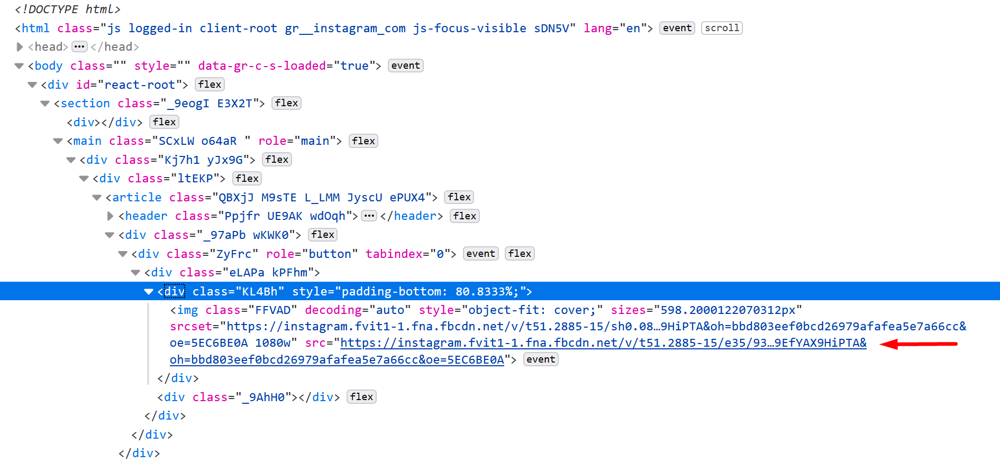

Instagram es la red del postureo. Es probablemente la red social que más uso. Soy demasiado joven como para usar Facebook activamente y demasiado viejo siquiera para plantearme crearme TikTok (si veis que ocurre, os doy permiso para acabar con mi existencia). También uso twitter, pero más como proveedor de "noticias", pero no publico nada en esa red social.

Por lo tanto, todas mis publicaciones suelen ir a Instagram. A lo largo de los años me he dado cuenta de que se ha convertido en una especie de diario de hitos personales. Por encima de las fotos de mis viajes se pueden ver y observar fotos de cuando me saqué la carrera, de cuando vivía en Madrid y estaba en un estudio programando un videojuego o de buenos momentos con amigos. Aunque la calidad de las imágenes puede no ser la mejor, me gusta meterme de vez en cuando ahí y ver todos esos viajes y momentos.

Aun así, soy informático y se que la única manera de que tu información pueda estar segura es tener tú mismo una copia. Por ello llevaba tiempo planteándome realizar algún script que me permitiera bajarme todas las fotos de mi perfil. También podia usar esto para refrescar un poco Python y practicar algo de Web Scrapping.

# Web Scrapping con Selenium

Hace tiempo hubo un intento fallido por mi parte, principalmente porque intente descargar, _parsear_ y buscar las páginas a mano. El problema es que una página no consiste únicamente en un HTML, y hacerlo a mano implica ir "tirando del hilo" hasta obtener todos los recursos que componen una página. Por lo tanto lo deje aparcado. Eso hasta el otro día, en el que de pura casualidad encontré un [video][video-bot] en el que alguien programaba un bot para Instagram para ver la gente que le había dado unfollow. El objetivo que tenía me daba igual, pero quería ver como lo hacía.

Al ver como lo hacia vi que utilizaba una librería llamada [Selenium][selenium], que es una herramienta que permite automatizar un navegador. Es básicamente el santo grial del Web Scrapping, permite ahorrarte todo el engorro de realizar las peticiones, filtrar las páginas, buscar etiquetas, etc. Así que me baje el WebDriver para Firefox (es el puente que une la librería con el navegador), instalé la librería para Python y basándome en el video comencé a programar.

# Loguearse en Instagram


Lo primero que hay que hacer es hacer _log in_ en la página. Para ello, lo que hay que hacer es lo siguiente

1. Obtener la web. Al no habernos logueado, la web que aparecerá será la de login
2. Obtener los campos de usuario y contraseña y llenarlos
3. Pulsar el botón de _Log in_

Todo ello se hace en Python de la siguiente manera:

```python
class InstaBot:
    def __init__(self, username, pw):
        self.driver = webdriver.Firefox(executable_path="./geckodriver.exe")
        self.username = username
        self.driver.get("https://instagram.com")
        sleep(2)    
        self.driver.find_element_by_xpath("//input[@name=\"username\"]")\
            .send_keys(username)
        self.driver.find_element_by_xpath("//input[@name=\"password\"]")\
            .send_keys(pw)
        self.driver.find_element_by_xpath('//button[@type="submit"]')\
            .click()
        sleep(4)
        self.driver.find_element_by_xpath("//button[contains(text(), 'Ahora no')]")\
            .click()
        sleep(2)
```

Como se puede ver, he metido el código en el constructor de una clase, que es la clase donde voy a implementar todo. Está en el constructor porque, independientemente de lo que se quiera hacer, es necesario realizar ese login. Los `sleep()` son necesarios ya que hay que dejar tiempo para que cargue la página.

Si se ejecuta eso, se ve que en realidad es el mismo proceso que realizaría cualquiera para meterse en Instagram, solo que automatizado. Incluso se puede ver en directo en el navegador aislado que abre el WebDriver. No voy a indagar en cada función, ya que creo que los nombres son muy explicativos y es fácil comprender que esta haciendo cada una.

# Obtener todos los posts


Una vez hecho eso, mi idea era ir a la página del perfil, coger cada enlace a cada post y de cada uno coger la URL donde se encuentra la imagen. Este es un proceso que ya he hecho a mano, por lo tanto se que las imágenes de Instagram se pueden coger si vas inspeccionando el HTML en búsqueda de la URL de la imagen, la URL de un post suele ser algo así, que esta en la etiqueta `` anidada por varios `<div>`:



Pero antes de llegar a eso, es necesario coger los enlaces a todos los post, para poder buscar el enlace de la imagen para cada uno de ellos. Los enlaces de un post de Instagram tienen el formato `https://www.instagram.com/p/B--N-oBKdPL/`. Para cogerlos, una vez llegados la página del perfil, hay que ir bajando abajo e ir buscando estos enlaces. 

Mi idea inicial era hacer scroll hasta abajo del todo y después buscar todos los enlaces. El problema es que la página de perfil solo mantiene un número de post cargados en el grid y, a medida que se va bajando y se va cargando nuevos, los anteriores desaparecen. En mi experiencia suele mantener cargados en torno a 30. Por lo tanto, lo que habría que hacer es hacer scroll e ir cogiendo los enlaces. Para ello he creado la función `get_pictures_links()`, que contiene lo siguiente:

```python
def get_pictures_links(self):
    self.driver.find_element_by_xpath("//a[contains(@href,'/{}')]".format(self.username))\
        .click()

    sleep(2)

    links = []

    last_height = self.driver.execute_script("return document.body.scrollHeight")
    while True:
        self.driver.execute_script("window.scrollTo(0, document.body.scrollHeight);")
        sleep(2)

        links_elements = self.driver.find_elements_by_xpath('//a[contains(@href,"p/")]')

        for elem in links_elements:
            links.append(elem.get_attribute('href'))

        new_height = self.driver.execute_script("return document.body.scrollHeight")
        if new_height == last_height:
            break
        last_height = new_height

    links = list(set(links))
    return links
```

Hay varias cosas a resaltar en el fragmento anterior:
- El scroll se hace mediante JavaScript. Para ejecutar código JavaScript en la web se usa la función `execute_script()`
- El contador de altura sirve para saber cuando hay que parar de bajar. Si al bajar sigue en la misma altura del final se para
- Para buscar los enlaces a los post hay que buscar las etiquetas `<a>` correspondientes. En este caso se busca una etiqueta de enlace que contenga `/p` en el atributo `href`.
  - Una vez obtenida la etiqueta o, como en este caso, la lista de etiquetas que cumplen ese criterio, se obtienen los atributos en sí, que son las URL que queremos. Estas se guardan en la lista.
- Por como funciona el grid, lo normal es acabar cogiendo valores repetidos, ya que las etiquetas se van descargando al cabo del tiempo, pero se mantienen durante varios scrolls. Por lo tanto, al final del todo, se hace el `list(set(links))` para eliminar duplicados (se pasa a un set, que no puede contener repetidos, y después a una lista para dejarlo como antes). Hacer eso deja los elementos desordenados, pero en este caso no importa. De las soluciones que he encontrado en [StackOverflow][stack-overflow-delete-duplicates], esa me parecía la más limpia y apta para este caso.

# Obtener los _permalinks_ a las imágenes

Con todos los posts, no queda más que ir uno a uno, para abrirlos y buscar las imágenes que contienen. Para ello, he creado la función `get_picture()`, a la que le voy pasando cada uno de los links que previamente he obtenido y busco la imagen para descargarla.

```python
def get_picture(self, link):
    self.driver.get(link)
    sleep(2)
    try:
        img_element = self.driver.find_element_by_xpath('//img[contains(@class,"FFVAD")]')
        url = img_element.get_attribute('src')
        time_element = self.driver.find_elements_by_tag_name('time')
        timestamp = time_element[0].get_attribute('datetime')
        if url is not None and timestamp is not None:
            timestamp = timestamp.replace(':', '-')
            timestamp = timestamp.replace('.', '-')
            print(url)
            urllib.request.urlretrieve(url, timestamp + '.jpg')
    except:
        pass
```

Obviando que no trato la excepción (y debería), aquí es donde realmente ocurre la magia y donde hay más problemas. De momento la forma más sencilla que he encontrado para obtener la etiqueta que contiene la imagen real, es buscarla mediante su clase. Los nombres de todas las clases que se usan en el HTML de la web de Instagram están ofuscados. Pero, basándome en las pruebas que he estado realizando, estos no cambian en el tiempo, por lo tanto usando ese nombre de clase. Una vez sabiendo cómo hacerlo, es muy fácil encontrar con Seleniun la etiqueta y obtener la URL.

Además, para poder guardar las imágenes también obtengo el timestamp de cuando se publicó el post. A partir de ahi, no hace falta mas que descargar la imagen con `urllib`.

# Conclusión

El bot tiene muchas partes con margen de mejora. Hasta ahora no he hablado de los post que contienen un video ni de los post que contienen varias imágenes. Iré mejorándolo con el tiempo, pero creo que tal y como esta es una buena herramienta para entender como hacer Web Scrapping a nivel básico. Voy a dejar el código en un [repositorio de GitHub][github-repo], donde se irán pudiendo ver dichas mejoras.

# ¿Y la API de Instagram?

En este punto quizás alguien se plantee por que hacer todo esto y no usar directamente la API de Instagram. Por un lado, se que hay una nueva API, pero no la conozco. Mi objetivo es intentar hacer lo mismo que hace esta herramienta pero con dicha API. La que conozco es API anterior, la cual me parece limitada y pronto quedará en desuso.

Aun así, el objetivo de este bot es no depender de si Instagram te va a permitir obtener dichas imágenes o no. Al fin y al cabo, una vez habiéndote logueado en la aplicación, técnicamente se pueden coger todas las imágenes que quieras, por lo que deberías ser capaz de hacerlo también de manera programática.

Al final, no consiste en si Instagram te va a dejar o no, sino en: ¿si puedes, por qué no hacerlo?


[video-bot]: https://www.youtube.com/watch?v=d2GBO_QjRlo
[selenium]: https://www.selenium.dev/
[stack-overflow-delete-duplicates]: https://stackoverflow.com/a/7961393
[github-repo]: https://github.com/ander94lakx/InstaBot