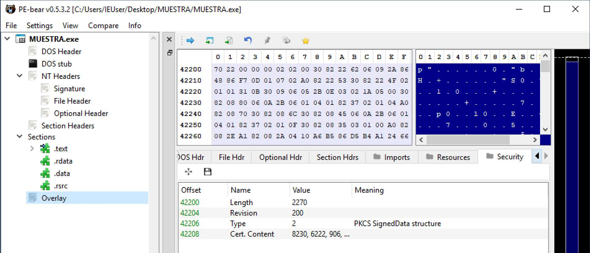
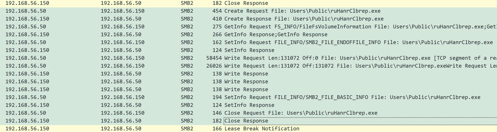
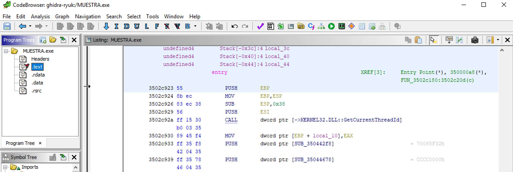
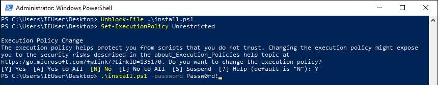
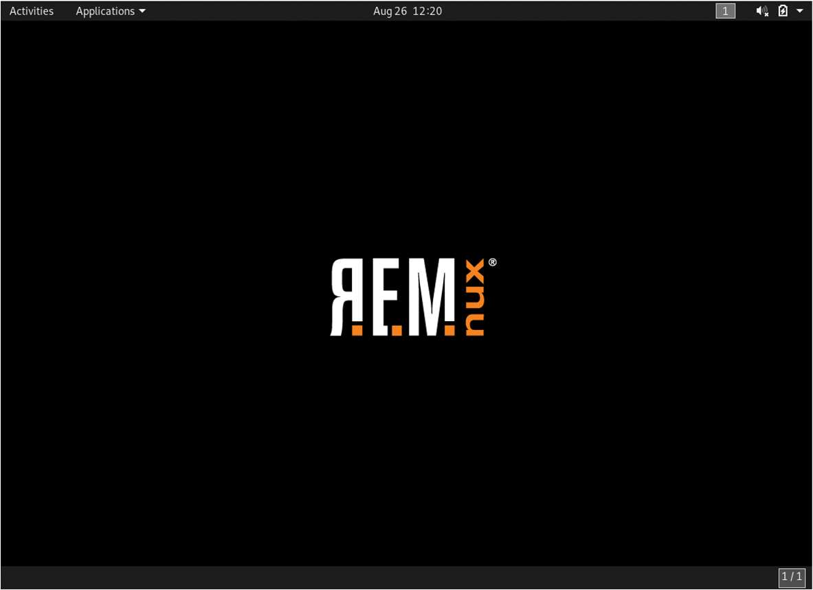

Estamos rodeados por malware. Todo el mundo ha tenido alguna vez un problema con algún tipo de virus o al menos conoce a alguien que lo haya tenido, al igual que conoce o trabaja en alguna empresa a la que le hayan atacado.

Personalmente, el malware me parece fascinante. Lo que me fascina es la eficacia que estos tienen. Son cuidadosamente diseñados para cumplir con su labor y hay ejemplos tan sofisticados que es alucinante ver cómo a alguien se le ha podido ocurrir programar algo de esa manera para explotar una vulnerabilidad o utilizar ciertos tipos de mecanismos de evasión.

Cada vez que veo una noticia de un nuevo ransomware, troyano o malware de algún tipo, siento curiosidad por saber como funciona. Suelo ojear los informes técnicos que salen de los ataques más sonados en búsqueda de más información y me quedo alucinado por los informes de los analistas. En parte, por las características de los casos que analizan y las formas en las que funcionan los malware, pero, por otra parte, por como son capaces de obtener toda esa información.

Este tipo de informes son realizados por analistas de malware. A veces están dentro de los equipos de DFIR de una empresa, otras son organizaciones gubernamentales o militares y otras veces es un hacker cualquiera posteando en su blog sobre una muestra con la que está jugando. Lo que está claro es que cogen una muestra de un malware y la analizan. Es un campo fascinante que me llama mucho la atención porque mezcla disciplinas que me parecen muy interesantes. Mezcla informática forense con ingeniería inversa y conocimientos a bajo nivel de los sistemas. Es como el plato combinado perfecto.

Últimamente he estado aprendiendo sobre esta area. Incluso hace no mucho realicé [mi TFM](https://github.com/ander94lakx/TFM_Doc) sobre ello. Para poder recolectar las cosas interesantes que he ido aprendiendo, he decidido escribir una serie de posts (y con ello retomar un poco este blog) sobre el proceso y algunas de las técnicas que se usan. Nno soy un experto en el tema, pero espero poder ayudar a quien lo lea y, por que no, a mi mismo al organizarme las ideas.

## ¿Qué es el análisis de malware?

El análisis de malware consiste en todas estas técnicas y procesos que permiten obtener información sobre cómo funciona un malware. El funcionamiento de cualquier programa, y por ello también el de un malware, depende de su código. Si se tuviera el código de un malware simplemente bastaría con examinarlo para conocer cómo funciona. En este caso no va a haber esa suerte. Lo mejor que podremos tener es algún tipo de código ofuscado o compilado, normalmente un binario.

Hay muchos tipos de malware. Un malware puede ser ese pedacito de JavaScript que se te ha colado en esa web con el objetivo de minar crypto para alguien y, a cambio de ello, convertir tu ordenador en un radiador. Un malware también puede ser ese .exe que te han colado como activador para tu Office pirata. Según el tipo de malware, se analizará de una manera u otra.

Yo en este caso me voy a centrar en malware para Windows y para arquitecturas x86 y x86_64. Si se piensa en ejemplos de malware, probablemente lo que más venga a la cabeza sean ejemplos para este tipo de sistemas y son los más comunes de encontrar.

En esencia, analizar malware consiste en comprender el funcionamiento de un programa, pero sin tener acceso directamente al código fuente. Es como tener una caja negra e intentar entender como funciona: puedes abrirle las tripas para intentar sacar el código, puedes lanzarla y ver como interactúa dentro de un sistema o puedes coger y analizar la forma de la caja para obtener pistas sobre ella.

## ¿Qué se hace para analizar un malware?

Hay diferentes procesos y técnicas para analizar malware. Hay incluso procesos y metodologías que se pueden seguir y que estandarizan la forma de hacerlo. Aun con ello, analizar malware consiste, en esencia, en sacar información sobre él: cómo funciona, qué mecanismos tiene para evadirse, cómo y con quién ese comunica, qué mecanismos usa para persistir o propagarse, etc.

Las técnicas que se utilizan para sacar esa información son diversas, pero todas ellas se pueden dividir, a grandes rasgos, en las siguientes:

- **Análisis estático**: consiste en analizar información sobre el malware sin analizar su código ni ejecutarlo: metadatos, firmas, formato y secciones del binario, etc.

    

- **Análisis dinámico**: también llamado análisis de comportamiento, consiste en analizar la muestra mientras se ejecuta: ficheros con los que interactúa, llamadas al sistema, trafico de red, cambios en el registro, etc.

    

- *Análisis de código*: como su nombre indica, consiste en observar el código y se distingue en dos tipos:

    

    - **Análisis estático de código**: analizar el código sin ejecutarlo.
    - **Análisis dinámico de código**: analizar el código mientras se ejecuta, es decir, depurarlo.

Como se puede ver, todo lo estático esta relacionado con analizar sin ejecutar, mientras que la parte dinámica tiene que tener el malware en ejecución. También se puede distinguir entre técnicas en función de si se analiza el código o no. Al analizar una muestra, lo normal es que se realicen algunos tipos de tareas antes que otras. Las técnicas de análisis estático suelen ser fáciles de realizar y suelen hacerse al principio. Por el contrario, analizar el código es una tarea tediosa y suele hacerse más adelante, Aunque todo ello depende del proceso y del analista.

## ¿Como empiezo a analizar malware?

Aquí no hay discusión, para analizar malware necesitas un entorno aislado. Coger malware y meterlo en tu ordenador para comenzar a trastear con él es mala idea. Si nadie quiere que se le cuele malware en su equipo sin querer, como para hacerlo a propósito.

La mejor forma para tener un entorno aislado es hacer uso de una máquina virtual. Se puede usar lo que se quiera (VirtualBox, VMWare, ...). En mi caso soy más de usar VirtualBox, pero cualquiera es perfectamente válido. Una vez se tenga el software de virtualización, hace falta crear obtener una ISO con Windows, crear la maquina virtual, cargar la imagen en... ¿O quizás no?.

Es cierto que uno mismo puede buscar la ISO, crear la máquina e instalar Windows en ella, pero hay una forma más sencilla de obtener una VM con Windows, y es descargarla directamente de internet. La mejor opción son las VM que ofrece Microsoft para desarrolladores. Hay varias opciones. Se puede optar por una maquina que tiene un [entorno de desarrollo completo](https://developer.microsoft.com/en-us/windows/downloads/virtual-machines/) (es más grande, pero si se quiere ademas usarla para desarrollar malware puede estar bien), o las máquinas virtuales que tienen [para testear aplicaciones](https://developer.microsoft.com/en-us/microsoft-edge/tools/vms/) en Edge, más ligeras y, en mi opinión, la mejor opción. De estas últimas, ademas de Windows 10, también hay versiones para Windows 7 y Windows 8, que para malwares viejos puede ser interesante. Hay versiones para los software más famosos, como VirtualBox o VMWare, así que con seleccionar la version deseada, bajarse el archivo y cargarlo en el software de virtualización necesario es más que suficiente.

### ¿Qué herramientas necesito para analizar malware?

Con una máquina virtual ya lista solo hace falta prepararla con las herramientas necesarias para analizar malware. Hay una gran cantidad de herramientas para analizar malware. Algunas como IDA o Ghidra sonarán a muchos. Al principio es normal no tener ni idea de cuales instalar. Lo mejor para estos casos es hacer uso de [FLARE-VM](https://github.com/mandiant/flare-vm), una herramienta para instalar y mantener actualizados todo un conjunto de herramientas para analizar malware.

Con usar esta herramienta sobre nuestra máquina y dejarle un rato para que instale todo, tendremos una maquina con todas las herramientas que se necesitan. Es la mejor opción, sobre todo, para probar todo tipo de herramientas y ya, en un futuro, poder crearte tu propio laboratorio solo con las herramientas que te gusten. La única desventaja que tiene usar algo como FLARE-VM es que nos va a engordar nuestra VM considerablemente (unos 60GB de VM ya te deja). A parte de eso, es tan sencillo como seguir los [pasos de instalación](https://github.com/mandiant/flare-vm#windows-10-installation) indicados en su repositorio.

También existen otro tipo de herramientas o directamente distribuciones que vienen ya con todo listo para usar. Una de mis favoritas es [Remnux](https://remnux.org/), una distribución linux que viene prácticamente con todo. Tiene herramientas hasta para analizar malware para Windows. El único problema que tiene para analizar malware para Windows es que no vamos a poder ejecutarlo sobre esa máquina. Aun asi, es muy recomendable también.

Si, aun así quieres instalar las herramientas a mano, te dejo algunas de las herramientas que me gustan a mí. Hay muchas mas, y esto depende de gustos y necesidades, pero a mí, algunas de las que me gustan son:

- Para análisis estático:
    - [PEstudio](https://www.winitor.com/) y [DIE](https://github.com/horsicq/Detect-It-Easy) para analizar binarios.
    - [ssdeep](https://ssdeep-project.github.io/ssdeep/index.html) y [YARA](https://virustotal.github.io/yara/) (y las [Yara-Rules](https://github.com/Yara-Rules/rules)) para clasificar y buscar malware similar.
    - [capa](https://github.com/mandiant/capa) para obtener de un vistazo pistas sobre las capacidades de una muestra.
- Para análisis de código:
    - [IDA](https://hex-rays.com/ida-free/) para reversing y analizar código.
    - [Ghidra](https://ghidra-sre.org/) para cuando no puedas decompilar las muestras en IDA porque no te sobran miles de euros.
    - [x64dbg](https://x64dbg.com/) para ~~crackear videojuegos~~ depurar muestras.
        - Mejora mucho con [ScyllaHide](https://github.com/x64dbg/ScyllaHide) y [xAnalizer](https://github.com/ThunderCls/xAnalyzer), dos plugins indispensables.
- Para análisis de comportamiento:
    - [Process Hacker](https://processhacker.sourceforge.io/) y las [SysInternals](https://docs.microsoft.com/en-us/sysinternals/) de Windows, en especial [Process Monitor](https://docs.microsoft.com/en-us/sysinternals/downloads/procmon) para poder monitorizar y analizar procesos y eventos del sistema.
        - Los PML de Process Monitor son tu mayor aliado.
    - [Regshot](https://sourceforge.net/projects/regshot/) para capturar y comparar cambios en el registro.
    - [Wireshark](https://www.wireshark.org/) para capturar y analizar tráfico de red.
    - [Belkasoft Acquisition Tool](https://belkasoft.com/es/bat) para volcados de memoria
- Otros:
    - [HxD](https://mh-nexus.de/en/hxd/) como editor hexadecimal.
    - Una taza con café al lado.

## ¿Y ahora qué?

Con todo listo y preparado, solo queda buscar una muestra para empezar a jugar. Para no abrumarse demasiado, lo mejor es optar por muestras de malware que ya hayan sido analizadas y no sean demasiado complejas. En repositorios como [TheZoo](https://github.com/ytisf/theZoo) hay muestras de malwares famosos. También se puede buscar alguno concreto en plataformas como [MalwareBazaar](https://bazaar.abuse.ch/).

Otra opción consiste en probar este tipo de herramientas y técnicas con crackmes. Un crackme es el equivalente a una máquina de Hack The Box o TryHackMe pero para reversing. No son específicos para analizar malware, pero las técnicas que se usan con, en esencia, las mismas. Webs como [crackmes.one](https://crackmes.one/) tienen muchos crackmes de diferentes dificultades con los que practicar.

En los próximos posts explicare algunas de estas técnicas sobre una muestra de malware real para poder ver como se aplican las diferentes técnicas y como se usan las herramientas.

Happy hacking!