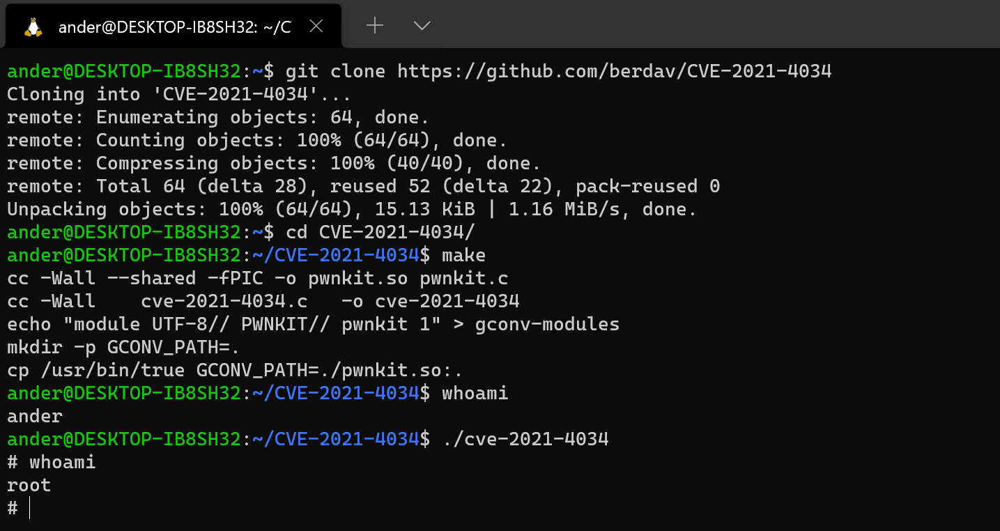

Otro nuevo CVE de los que han dado que hablar. El [CVE-2021-4034](https://nvd.nist.gov/vuln/detail/CVE-2021-4034) salió a la luz hace unos días y se ha esparcido como la pólvora. No es que yo pueda aportar mucho más al tema del que no se haya dicho ya, pero si que puede estar bien hacer un repaso esquemático al CVE y a como explotarlo (que es trivial).

## ¿Qué es polkit?

[Polkit](https://wiki.archlinux.org/title/Polkit) es una herramienta que permite controlar los privilegios en sistemas de tipo Unix. Puede controlar la forma en la que los procesos sin privilegios se comunican con procesos con privilegios.

Esto es util porque hay muchos casos en los que interesa que un proceso interactúe con procesos privilegiados unicamente para determinadas acciones, pero que no pueda hacer otras. En vez de usar algo como sudo (que sería como "abrir todas las puertas y a ver que pasa"), con Polkit se puede controlar en mayor detalle este tipo de operaciones.

## ¿Cuál es la vulnerabilidad?

Polkit tiene una utilidad llamada [pkexec](https://linux.die.net/man/1/pkexec). Esta utilidad permite ejecutar comandos como otro usuario o como root. Esta utilidad tiene una vulnerabilidad, ya que no parsea bien el número de parámetros que recibe y permite ejecutar variables de entorno como comandos (!).

Entonces, según lo que se le pase como variables de entorno, se puede ejecutar código arbitrario. De ahí, se escala privilegios y se consigue permisos de admin, es decir, root.

## ¿Cómo se puede explotar la vulnerabilidad?

Obviamente, ya hay exploits para ello. Para ver lo fácil que es, se puede poner como ejemplo el exploit de [Davide Berardi](https://github.com/berdav/CVE-2021-4034). Ponerlo a prueba es tan sencillo como clonar, compilar, ejecutar y win!

```bash
git clone https://github.com/berdav/CVE-2021-4034
make
./cve-2021-4034
```

Y _voilà_! ahí tenéis la consola con root.



## ¿Qué sistemas son vulnerables?

Pues diría que prácticamente todos. Aquí no se libra ni el apuntador. Se [ha logrado explotar](https://blog.qualys.com/vulnerabilities-threat-research/2022/01/25/pwnkit-local-privilege-escalation-vulnerability-discovered-in-polkits-pkexec-cve-2021-4034) la vulnerabilidad en instalaciones por defecto de Ubuntu, Debian, Fedora, CentOS y muchas más distribuciones. Al fin y al cabo, teniendo en cuenta que es un componente que se encuentra en prácticamente todas las distribuciones Unix-like.

Lo peor ya no es eso, sino que la vulnerabilidad lleva [más de 12 años](https://gitlab.freedesktop.org/polkit/polkit/-/commit/c8c3d835d24fc4ce5a9c596c7d55d85a0311e8d1) en el código (!). A mi, personalmente, esta es la parte que me asusta de este tipo de vulnerabilidades, las que llevan desde hace mucho pudiendo ser explotadas, por no poder saber hasta que punto se ha podido hacer uso de ella.

## ¿Cómo mitigar la vulnerabilidad?

Todo el mundo se ha puesto las pilas y han lanzado parches para ello, por lo que a estas alturas, con actualizar a través del gestor de paquetes debería ser suficiente para mitigarla.

En el mismo repo del exploit que he mostrado hay una version simplemente para probar si se es vulnerable, que se puede probar de la siguiente manera:

```bash
make dry-run
dry-run/dry-run-cve-2021-4034
```

Otra opción, en caso de que no se pudiera actualizar el sistema, por la razón que fuese (mala idea por cierto, hay que tener siempre actualizados los sistemas), puede ser desactivar el bit SUID de pkexec. Un `chmod` para eliminar el bit para todos:

```bash
chmod ug-s /bin/pkexec
```

De esta manera se impide que el exploit pueda escalar privilegios, aunque puede tener muchas consecuencias imprevistas (como en Half Life :)).

## Conlusiones

A modo de resumen, os dejo unos puntos que me vienen a la cabeza tras ver una vulnerabilidad de este tipo:

- Cuidad vuestras entradas, sobre todo en lenguajes como C y al tratar con elementos a mas bajo nivel.
- Nunca se puede estar completamente seguro. Siempre hay vulnerabilidades que no conocemos pero que pueden ser descubiertas por otros.
- Cuanta más gente este del lado de los buenos, más vulnerabilidades de este tipo se podrán descubrir y con mayor rapidez.
    - Imaginaos las consecuencias de que esto caiga en malas manos (y no solo hablo de cibercriminales ;)).

Así que ya sabéis, a actualizar vuestros sistemas!

Happy hacking!

## ¡Exijo más detalles!

Pues aquí los tienes:

- El [reporte original](https://www.qualys.com/2022/01/25/cve-2021-4034/pwnkit.txt).
- Artículo en [su blog](https://blog.qualys.com/vulnerabilities-threat-research/2022/01/25/pwnkit-local-privilege-escalation-vulnerability-discovered-in-polkits-pkexec-cve-2021-4034).

_PD_: explicaría en detalle la vulnerabilidad, pero creo que ya esta muy bien explicada en cientos de artículos y videos, y no me voy a creer mejor que ellos. Mi objetivo aquí era simplemente hacer un breve resumen de una vulnerabilidad que me ha parecido interesante.