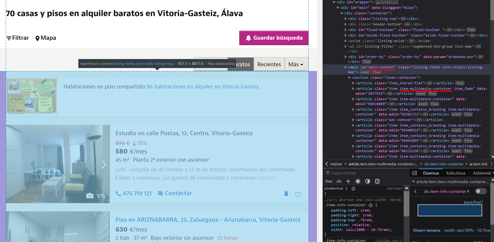
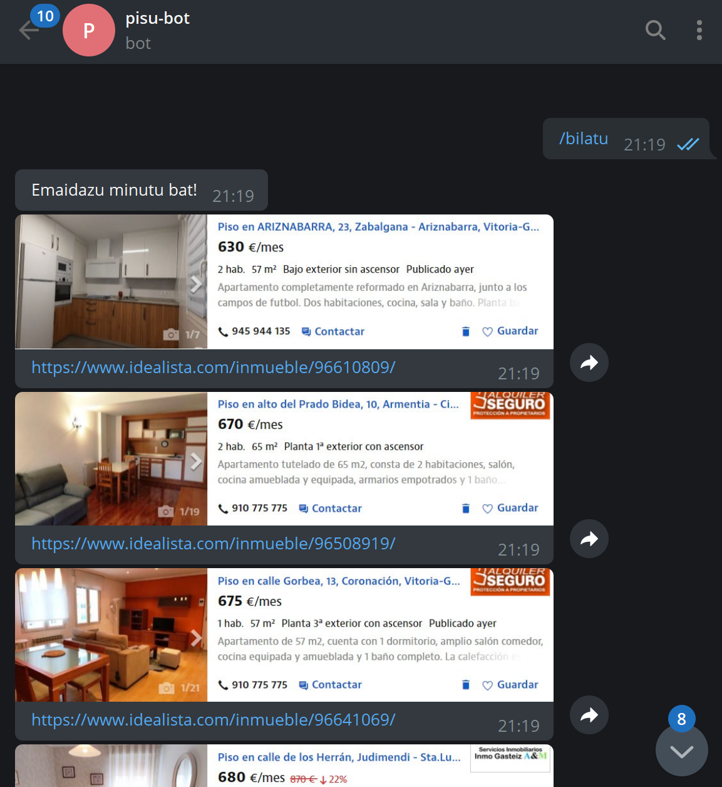

Estoy buscando piso y es un proceso de mierda. Hay una cantidad extrañamente escasa de pisos en mi ciudad y los que hay desaparecen rápidamente.

Me da pereza meterme todo el rato a buscar piso. En realidad no es algo tan complicado, pero a veces estoy ocupado y se me pasa mirar ese día, o estoy fuera y con el móvil es más engorroso.

Llevaba tiempo queriendo probar a hacer un bot de Telegram. No sabía que hacer exactamente, pero el otro día se me iluminó la bombilla. As que he creado un bot que me avisa de los pisos que hay en mi ciudad disponibles.


Esto tiene dos partes. Una es la parte de web scraping. Esto es básicamente automatizar la extracción de información de sitios web. Hoy en dia casi todo se hace desde internet y buscar piso no iba a ser menos. Prácticamente todas las inmobiliarias locales y los particulares que alquilan piso cuelgan sus anuncios en alguna plataforma como Idealista o Fotocasa, así que consultando ahí puedo ir viendo que opciones nuevas van apareciendo. Es básicamente lo que estaba haciendo hasta ahora a mano y sin la constancia suficiente. Automatizándolo con web scraping me permite obtener toda esa información de un vistazo.

La otra parte es la del bot de Telegram. Hasta hace dos días no tenia ni idea de como iba. Básicamente Telegram tiene una API cojonuda para poder hacer de todo con ella. Se pueden crear bots que se ejecuten donde sea para comunicarse directamente con los usuarios, escribir en chats o canales y realizar mil cosas. A parte, hay un [wrapper para Python](https://github.com/python-telegram-bot/python-telegram-bot) muy bueno con el que se puede utilizar la API desde Python de manera muy sencilla.

## Parte 1: web scraping con Selenium

No es la primera vez que hago web scraping. Hace tiempo hice un script que permitía scrapear instagram para descargar todas las imágenes de un usuario. Podéis echar un vistazo al [post](https://ander94lakx.github.io/blog/2020-04-25-instagram-bot-python/) que hice o al [código](https://github.com/ander94lakx/InstaBot) del bot (es un bot, pero no es un bot de Telegram, ojo).

Cuando hice ese script utilicé [Selenium](https://www.selenium.dev/), que es probablemente la mejor herramienta para web scraping que existe. No sirve solo para eso, pero permite automatizar el manejo de navegadores. Con esto lo que se puede hacer, es abrir webs, navegar por ellas, realizar acciones y extraer información de ellas programáticamente. Esto es mucho mejor que mandar directamente request con una librería para realizar peticiones, ya que al lanzar realmente una instancia de un navegador, se pueden saltar medidas que algunos sitios web tienen para bloquear mecanismos automatizados. La pega que tiene es que, al tener que abrir un navegador, no se puede ejecutar en un entorno que no tenga pantalla (aunque esto se puede solucionar fácil con librerías que simulan pantallas como [PyVirtualDisplay](https://pypi.org/project/PyVirtualDisplay/)).

Con las herramientas listas e instaladas, solo queda usar Selenium para comenzar a hacer web scraping. En este caso lo simple es mejor. en vez de pasarle la URL base de un sitio de búsqueda de pisos, se puede sacar las URL con los parámetros para filtrar la búsqueda. En mi caso, y poniendo Idealista como ejemplo, la URL sería algo así:

```bash
https://www.idealista.com/alquiler-viviendas/vitoria-gasteiz-alava/?ordenado-por=precios-asc
```

Como se puede ver, ya estoy filtrando por mi ciudad, a parte de que ordena por precio para que aparezcan los más baratos primero (no hay mucha pasta por aquí). Esto se podría acotar mucho más. Como la mayoría de sitios de este tipo usan los parámetros de búsqueda en la propia URL (algo muy útil para poder después guardar marcadores con ello), se puede ahorrar muchísimo trabajo de scraping solo con elegir la URL adecuada.


Con eso en mente, he creado una sencilla función que permite hacer web scraping para obtener los pisos. Le he puesto una opción para filtrar por precio (aunque es algo que se puede hacer también a través de la URL). El código es el siguiente:

```python
def scrap_idealista(max_price):
    driver = initialize_driver(IDEALISTA_URL)
    scroll_down_and_up(driver)

    # Be kind and accept the cookies
    try:
        driver.find_element_by_id('didomi-notice-agree-button').click()
    except:
        pass # No cookies button, no problem!

    # Find each flat element
    elements = driver.find_element_by_xpath('//*[@id="main-content"]')
    items = elements.find_elements_by_class_name('item-multimedia-container')

    flat_list = []

    for item in items:
        # Get the link for that flat
        link = item.find_element_by_xpath('./div/a[@href]')
        link = link.get_attribute('href')

        # Get the price for that flat
        result = re.search('.*\\n(.*)€\/mes', item.text)
        price_str = result.group(1).replace('.', '')
        price = int(price_str)

        if price <= max_price:
            flat_list.append({ 
                'link': link, 
                'price': price,
                'image': item.screenshot_as_png, 
                'image_name': item.id + '.png' 
            })
    
    driver.quit()
    return flat_list
```

Aquí se ven varias cosas, pero por lo general es bastante sencillo de entender. Antes que nada, se carga el driver de Selenium y se hace scroll por toda la página. Lo primero carga la web y permite tener todo listo para comenzar a buscar. El scroll es debido a que, en ocasiones, las webs van ofreciendo contenido a medida que el usuario va haciendo scroll, por lo que hacer un scroll rápido antes de comenzar a sacar información está muy bien.

```python
def initialize_driver(url):
    driver = webdriver.Chrome(executable_path='./chromedriver.exe')
    driver.get(url)
    sleep(2)
    driver.set_window_position(0,0)
    driver.set_window_size(1920, 1080)
    return driver
```

Usar Selenium es muy sencillo. En este caso estoy usando el driver para Chrome, que tengo justo en mi directorio, por conveniencia. Tras ello, cargar la URL y configurar la ventana para que tenga un tamaño decente. Esto es importante, porque los elementos estarán colocados de diferente manera en función del tamaño de la ventana. El diseño responsive está muy bien, pero es uno de los peores enemigos del *scrapper*, así que poner una resolución consistente es importante para obtener siempre los mismos resultados.

```python
def scroll_down_and_up(driver):
    driver.execute_script('window.scrollTo(0, document.body.scrollHeight);')
    sleep(2)
    driver.execute_script('window.scrollTo(0, 0);')
```

En lo que respecta al scroll aquí no hay nada especial. Un poco de JS y listo.

La chicha está después. Lo primero, aceptar las cookies para poder navegar por el sitio y que no se vea nada raro. Aquí es donde se puede ver la potencia de Selenium

```python
driver.find_element_by_id('didomi-notice-agree-button').click()
```

Se explica solo. Se coge el elemento con ese ID, que en este caso es un botón, y se click. Lo siguiente es buscar los elementos con la información de los pisos. Esas tarjetitas que aparecen en lista. Como todos los elementos de una web, tienen clases o atributos que los identifican.

```python
elements = driver.find_element_by_xpath('//*[@id="main-content"]')
items = elements.find_elements_by_class_name('item-multimedia-container')
```

En este caso he hecho búsquedas con XPath y a través de los nombres de las clases. Si se ve la web de idealista, se puede sacar esta información. En cada web será diferente. Lo bueno de Selenium es que te permite obtener elementos y después buscar dentro de ellos. Así, se puede ir paso a paso hasta llegar a donde se quiere.



Buscar a través del id y de las clases es sencillo. Buscar a través de XPath es más complicado pero muy potente. Esto se puede simplificar con una extensión como [xPath Finder](https://github.com/trembacz/xpath-finder), que te permite obtener el XPath de cualquier elemento de una web.

Con ello ya se tienen una lista de items, que son cada una de las tarjetitas esas. Aquí solo queda sacar la información que se quiera sacar.

```python
for item in items:
    # Get the link for that flat
    link = item.find_element_by_xpath('./div/a[@href]')
    link = link.get_attribute('href')

    # Get the price for that flat
    result = re.search('.*\\n(.*)€\/mes', item.text)
    price_str = result.group(1).replace('.', '')
    price = int(price_str)

    if price <= max_price:
        flat_list.append({ 
            'link': link, 
            'price': price,
            'image': item.screenshot_as_png
        })
```

Para esto hay muchas formas. Selenium te permite sacar el elemento como imagen, por lo que para después enviarlo de esa manera puede estar muy bien. En mi caso saco el piso como imagen (para enviar después por Telegram así), el precio (para ver que no se pase del tope establecido) y el link, para enviarlo junto a cada imagen para poder meterme en el piso que me interesa. El nombre de la imagen me permite después gestionar las imágenes para enviarlas por Telegram.

Y esto es todo, así de sencillo. Ya solo hay que enviar esa información por Telegram.

## Parte 2: crear un bot de Telegram

Crear un bot de Telegram es tan sencillo como usar [BotFather](https://t.me/botfather), el bot que te permite crear bots. Tras crear un bot con él, te da un token que es lo que te permite hacer lo que quieras con la API. La creación del bot es trivial, consiste en hablar con el bot.

Una vez teniendo un token se puede hacer uso del [wrapper para Python](https://github.com/python-telegram-bot/python-telegram-bot) que he mencionado. Instalar con `pip` y listo. Del wrapper he utilizado lo siguiente:

```python
import telegram
from telegram import Bot, Update
from telegram.ext import Updater
from telegram.ext import CallbackContext
from telegram.ext import CommandHandler
```

Con ello, se puede instanciar el bot con el token obtenido y crear callbacks que permitan estar a la escucha de comandos de manera sencilla.

```python
def init():
    with open('token.txt') as f:
        token = f.read()

    updater = Updater(token=token, use_context=True)
    dispatcher = updater.dispatcher

    logging.basicConfig(format='%(asctime)s - %(name)s - %(levelname)s - %(message)s',
                        level=logging.INFO)

    dispatcher.add_handler(CommandHandler('start', start))
    dispatcher.add_handler(CommandHandler('bilatu', bilatu))
    dispatcher.add_handler(CommandHandler('idealista', idealista))
    dispatcher.add_handler(CommandHandler('fotocasa', fotocasa))

    updater.start_polling()
```

Esa funcion se ejecuta al arrancar el script. Cojo el token de un archivo separado y creo el bot. En el código se ve que se crean cuatro handlers. Esos son los comandos que después se pueden ejecutar con el bot. en este caso son `/start`,`/bilatu` ("buscar" en euskera),`/idealista` ,`/fotocasa`. Así se puede buscar en todos o solo en uno en específico. Las funciones llamadas con los callbacks son las siguientes:

```python
def bilatu(update: Update, context: CallbackContext):
    scrap(update, context, 'all')

def idealista(update: Update, context: CallbackContext):
    scrap(update, context, 'idealista')

def fotocasa(update: Update, context: CallbackContext):
    scrap(update, context, 'fotocasa')

def scrap(update: Update, context: CallbackContext, site):
    send_initial_message(context, update)
    max_price = get_max_price(context)
    flat_list = []
    if site in { 'idealista', 'all' }:
        flat_list.extend(scrap_idealista(max_price))
    if site in { 'fotocasa', 'all' }:
        flat_list.extend(scrap_fotocasa(max_price))
    send_results(flat_list, update, context)
    send_final_message(context, update)

def send_initial_message(context, update):
    context.bot.send_message(chat_id=update.effective_chat.id, text='Emaidazu minutu bat!')

def send_final_message(context, update):
    context.bot.send_message(chat_id=update.effective_chat.id, text='Hortxe dauzkazu!')
```

Baásicamente se llaman a unas u otras funciones de scraping en función de el callback que se ejecuta. Los obtetos `context` y `update` permiten obtener la instancia del bot y toda la información relativa a los comandos que se han ejecutado (qué usuario los ha ejecutado, en que chat, grupo o canal, si ha pasado argumentos, etc.). Ahí también se puede ver los sencillo que es mandar un mensaje con un bot con la funcion `bot.send_message()`.

Lo interesante de esa parte es la función `send_results()`, que coge lo generado por las funciones de scraping (la lista de pisos, cada uno con toda la información mencionada) y lo envía por Telegram.

```python
def send_results(flat_list: list, update: Update, context: CallbackContext):
    for flat in flat_list:
        context.bot.send_photo(chat_id=update.effective_chat.id, caption=flat['link'], photo=flat['image'])
        sleep(1)
```

Esto tambien bastante sencillo. Para enviar un mensaje basta con indicar el id del chat (que es algo que se recibe en los callbacks, apra saber desde donde se ha llamdo al comando) y lo que se quiera mandar. Antes se ha visto como se mandaba un mensaje con `bot.send_message()`, pasando el chat y el texto. En este caso se envia la foto de cada piso con `bot.send_photo()`, indicando en `photo` la imagen recogida y en `caption` el link.

Con todo ello, es tan sencillo como lanzarlo y comenzar a buscar piso.



Tal y como queda me parece bastante elegante. Cogiendo el elemento entero como imagen se puede ver toda la información de un vistazo y poniendo el enlace se puede acceder al anuncio para obtener más información o directamente contactar con el anunciante. Otra opción podría haber sido coger el texto y haber creado una lista con los pisos y los enlaces, pero la primera forma me parece de las más elegantes y, sin duda, la más sencilla de todas.

## Parte 3: crear un canal de Telegram para informar de los pisos

Sí, con esto no tengo suficiente. Escribir un comando al bot es demasiado trabajo. Por ello, a parte de tener el bot así, he añadido un metodo para que el bot, cada cierto tiempo, escriba en un canal las ofertas que hay. Esto es basicamente lo msimo que hace por ejemplo el [bot de Manfred](https://t.me/getmanfred) con las ofertas de trabajo, pero con mayor frecuencia. Además, me gusta como en ese bot no va dejando los mensajes de días anteriores, sino que solo está el último mensaje. Así evita que se llene el canal de mierda y deja que haya solo lo que tiene que haber. Por ello, yo lo he hecho igual.

```python
def update_channel():
    # Get channel and bot info
    with open('token.txt') as f:
        token = f.read()
    with open('channel_id.txt') as f:
        channel_id = f.read()

    bot = telegram.Bot(token=token)

    # Remove previously sended messages
    stacked_messages = []
    with open('sent_messages.txt', 'r') as f:
        for line in f.readlines():
            stacked_messages.append(int(line))
    while stacked_messages:
        bot.delete_message(chat_id=channel_id, message_id=stacked_messages.pop())

    # Scrap all with the defaul top price
    flat_list = []
    flat_list.extend(scrap_idealista(top_price))
    flat_list.extend(scrap_fotocasa(top_price))

    # Send the messages with the info
    # Saves the message_id of the messages to be able to delete them on the next one
    stacked_messages.append(bot.send_message(chat_id=channel_id, text='Kaixo! Hamen dauzkazu oraintxe bertan dauden pisuak:').message_id)
    for flat in flat_list:
        stacked_messages.append(bot.send_photo(chat_id=channel_id, caption=flat['link'], photo=flat['image']).message_id)
        sleep(1)
    stacked_messages.append(bot.send_message(chat_id=channel_id, text='Hortxe dauzkazu!').message_id)

    with open('sent_messages.txt', 'w') as f:
        for message in stacked_messages:
            f.write(str(message) + '\n')
```

Lo sé, esto no es lo más limpio que has visto en tu vida. Es basicamente más de lo mismo pero gestionando los mensajes que se han enviado. Cada mensaje enviado tiene un `message_id`, que es lo que permite despues poder elimiarlos. Esta función basicamente elimina lo que se haya escrito antes en el canal, realiza el scraping, manda la información y guarda los `message_id` para poder borrar los mensajes la próxima vez. Guarda esos id en un fichero para que, si peta el bot, no se pierdan y se puedan borrar al iniciarlo de nuevo, así no queda basura en el canal.

En este caso, hace falta crear una instancia de `Bot` ya que no se recibe de ningun lado. Ademas de esto, es necesario tener el id del chat o canal en el que se quiera escribir. Hay muchos bots que permiten sacar esos id.

La idea tener el script en ejecucion 24/7 y con ello el bot siempre listo. Por un lado, con los handlers escuchando, lo que se hace con `updater.start_polling()` visto antes. Por otro lado, hay que tener alguna manera para ejecutar la función `update_channel()` cada cierto tiempo. Para ello se puede usar `schedule`, una librería que permite programar tareas de manera sencilla. Para instalar, usar `pip` y listo.

Para usarla para ejecutar `update_channel()` cada cierto tiempo, basta con añadir al final de la función `init()` lo siguiente:

```python
schedule.every().hour.at(":00").do(update_channel)

while True:
    schedule.run_pending()
    sleep(1) 
```

Como se ve, es muy sencillo de usar y el código se explica solo. No hay que asustarse por el `while True`. El polling de los callbacks se ejecuta en otros hilos, por lo que esto no interfiere. Esto hace que se quede indefinidamente comprobando si tiene que lanzar alguna tarea.

Con todo esto, ya solo queda dejarlo en algun lugar ejecutándose. Este tipo de cosas son perfectas para una Raspberry Pi o algo del estilo. También se puede meter en un VPS o en donde sea. Lo único que hay que tener en cuenta es que, o tenga pantalla, o se use alguna libreria como la mencionada para emularla. Además de que tiene que tener el navegador que se vaya a usar instalado.

También se pueden añádir más sitios a los que hacer scraping, es facilmente escalable. En mi caso uso Idealista y Fotocasa, pero basta con añadir más funciones de scraping. Obviamente, cómo coger la informacion varía de sitio a sitio.

## Conclusiones

Crear un bot de este tipo es una tarea sencilla, como se puede ver. Aquí la dificultad está en encontrar un piso decente que no cueste un ojo de la cara. Eso si que es difícil de verdad.

Hacer un bot para obtener información actualizada de una puede ser muy util. Usar web scraping en vez de usar APIs tiene sus ventajas. Lo primero es que la mayoria de webs no tienen APIs, por lo que en esos caso no queda otra. En los casos en las que sí tienen, pueden estar limitadas. Lo bueno del web scraping es que te permite coger **lo que tú quieras y como tú quieras**. Y que nadie os engañe; aqui, mientras no tires la web o extraigas datos de manera masiva, no hay delito.

Espero haberme explicado bien y que si lees esto te pique la curiosidad para trastear con estos temas. Yo, por mi parte no voy a parar :)

Por último, dejo aquí el [repo de GitHub](https://github.com/ander94lakx/pisu-bot) con el código completo. Como siempre, libre para que hagáis lo que queráis.

Y recordad: ***Scraping is not a crime!***
