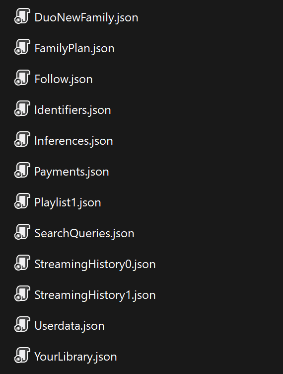

Estoy con el scrapping muy pesado, lo sé. Esta vez es algo un poco diferente. No es web scrapping al uso, sino un pequeño ejemplo sobre cómo sacar información sobre los datos de uno mismo. Se pueden sacar cosas muy interesantes de los datos que generamos a diario. En mi caso, por ejemplo, uso Spotify a diario para escuchar música. No salgo de casa sin unos auriculares y en mi casa llevo los cascos hasta para cagar, asi que genero cierta información al usar Spotify.

## Descargar tu información

Muchas aplicaciones dejan descargar a los propios usuarios la información que generan. Para los ciudadanos europeos debería decir que todas, ya que es un derecho que te otorga el [artículo 15](https://support.spotify.com/es/article/gdpr-article-15-information/) del RGPD de la Unión Europea. Esto hace que prácticamente todos los servicios online te dejen descargar una copia con tus datos, al menos en esta parte del globo.

Eso es muy interesante ya que te permite sacar información que las aplicaciones y servicios tienen sobre tí pero que, de por si, no te dejan ver a través de sus interfaces. Por ejemplo, en el caso de Spotify, te deja descargar tus [datos principales](https://support.spotify.com/es/article/data-rights-and-privacy-settings/), entre los que puedes ver, entre muchas cosas, el historial de reproducción de los últimos 365 días. Hya que matizar que, en el caso de Spotify, los datos que te otorgan con la herramienta que tienen para bajarte los datos no son completos, pero puedes pedir absolutamente todo [contactando directamente](mailto:privacy@spotify.com) con ellos.

De esta manera, algo que no se puede ver desde la app de Spotify se puede hacer a través de los datos que te permiten descargar. Normalmente este tipo de datos suelen venir en algún tipo de formato como JSON o XML para poder ser tratados programáticamente. A veces, incluso dejan elegir entre formatos, como por ejemplo el caso de Instagram, en el que se puede bajar una version en HTML (muy útil si se quiere tener una copia como backup) o en JSON (si lo que se quiere es tratar esos datos de alguna manera).

## Sacar lo más escuchado de la información de Spotify

Volviendo a Spotify, se pueden sacar muchísima información de esos datos. En mi caso, como prueba para comenzar a trastear con los datos, simplemente he programado un script para poder ver cuál es mi top de canciones y artistas más escuchados. Alguno podría pensar que esto ya te lo da Spotify en el ¨wrapped¨ que hace cada año o en alguna lista que genera. En parte es cierto, pero te lo da "a su manera". Es decir, igual puedes saber tu Top 5 de artistas más escuchados, pero no el Top 10, ni saber cuántas veces has escuchado a ese artista, ni cuánto has escuchado a un artista que no está en el top, etc. El potencial de tener todos los datos en tu mano es que puedes **sacar la información que quieras y como quieras**.

En este caso he probado con los datos básicos, que tienen información limitada. Si se pide la copia con toda la información, se pueden obtener muchos más datos. En la [documentación](https://support.spotify.com/es/article/understanding-my-data/) de Spotify se puede ver exactamente que datos te ofrece en ambos casos. Para el caso con los datos básicos, Spotify te da un zip con un puñado de archivos JSON.



Entre los archivos que da Spotify, los que interesan para esta prueba son los que se llaman `StreamingHistory[x].json`. Estos archivos contienen el historial de reproducción. La información respecto a la canción es bastante limitada pero la justa para saber cual es. El archivo tiene un formato como el siguiente:

```json
[
  {
    "endTime" : "2021-02-05 11:10",
    "artistName" : "Hüsker Dü",
    "trackName" : "Don't Want to Know If You Are Lonely",
    "msPlayed" : 212426
  },
  {
    "endTime" : "2021-02-05 12:16",
    "artistName" : "Queens of the Stone Age",
    "trackName" : "Go With The Flow",
    "msPlayed" : 4890
  },
  {
    "endTime" : "2021-02-05 12:23",
    "artistName" : "Queens of the Stone Age",
    "trackName" : "Go With The Flow",
    "msPlayed" : 190646
  },
  {
    "endTime" : "2021-02-05 12:24",
    "artistName" : "Queens of the Stone Age",
    "trackName" : "Make It Wit Chu",
    "msPlayed" : 19403
  },
```

Y así hasta el infinito. Te da el timestamp, nombre de la canción y artista y el tiempo de reproducción. Esto último es interesante porque puedes poner un mínimo para considerar que la canción haya sido escuchada, por ejemplo. También se puede jugar con el timestamp para ver cuando has escuchado mas o menos música. Las posibilidades son amplias.

Con esto, el script que he creado para sacar el top de canciones y artistas más escuchados es el siguiente:

`gist:ander94lakx/63776dacd6e986d935b9f01fff755921#spotify_top_songs_and_artists.py`

No creo que merezca la pena entrar en detalle en el código, ya que es muy sencillo y la mayoría se explica solo. Es básicamente en a función que realiza una serie de pasos que se pueden resumir en los siguientes pasos:

1. Gestionar un argumento para configurar el tamaño del Top.
2. Leer los archivos y cargar la información de los JSON en diccionarios.
3. Realizar las cuentas sobre la información cargada.
4. Ordenar, preparar y mostrar el top de canciones y artistas.

Probablemente se pueda mejorar de muchas maneras. Se podría unificar la parte en la que se coge los datos con la parte en la que se calcula las reproducciones, pero quería separarlo para que fuera más sencillo de entender. Por otro lado, mi Python no es perfecto y alguna cosa con los sets (y otras muchas cosas más) seguro que se pueden hacer mejor.

## Conclusiones

Tener los datos que generas en una aplicación te permite sacar mucha información. Las aplicaciones y servicios lo saben y utilizan esos datos para sacar información para beneficiarse. Que menos que, ya que ellos tratan la información de sus usuarios, que dejen hacer lo mismo a sus propios usuarios.

Ello, además, permite extender las capacidades que dan las propias aplicaciones. En el caso de Spotify, uno mismo podría hacer un análisis sobre la música que escucha, cómo la escucha o como ha ido cambiando en el tiempo, cosa que Spotify no ofrece a los usuarios. En el caso de otras aplicaciones se puede hacer mas de lo mismo. El hecho de poder obtener tu propia información es un primer paso para poder tratarla a tu manera.

Seguro que hay mil ejemplos de casos interesantes en los que se puede usar este tipo de información que generan las aplicaciones. Si estás leyendo esto, te invito a que te descargues tu información de las aplicaciones que usas, le eches un vistazo y pienses en que usos interesantes puedes darle. La información es poder y que menos que que los usuarios podamos tener también ese poder.

¡No paréis de descargaros lo que os pertenece!

Happy hacking!
